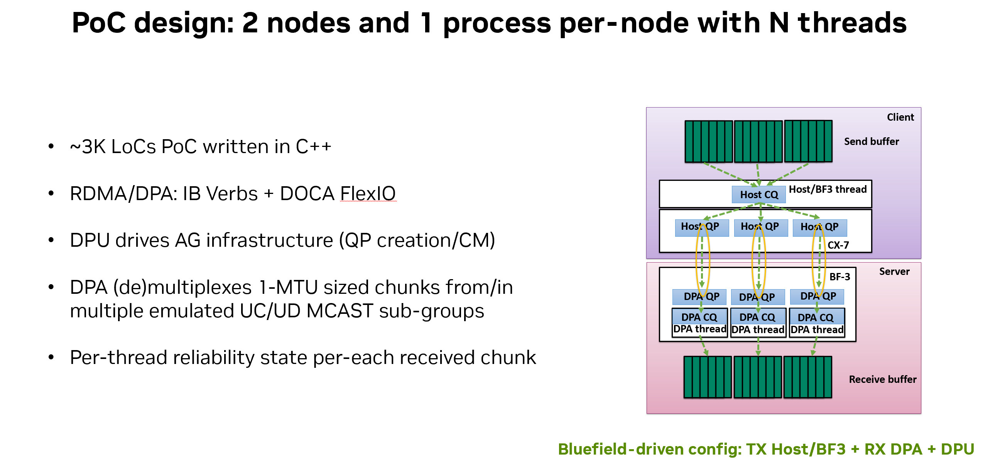
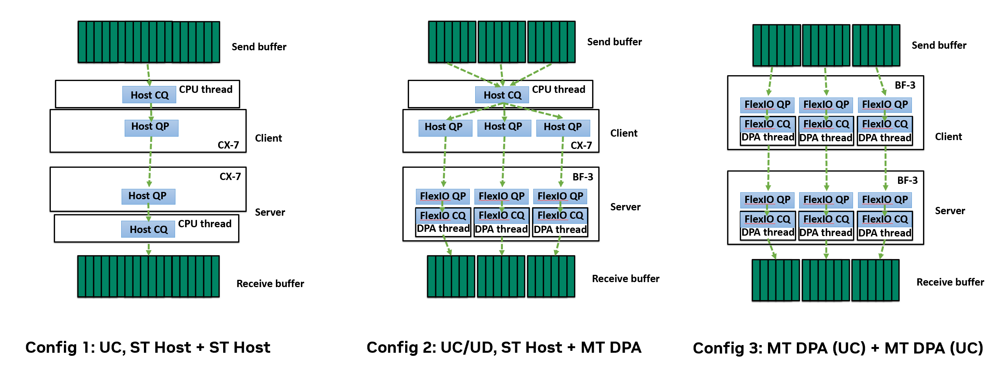

# Allgather receive path offloading POC architecture overview



## Processing engines and endpoints

Application client/server process specifies the *layout* of data processing on the send/receive in the two dimensions:
- *Processing Engines (PEs)* are used to execute application datapath code, e.g., to write multi-threaded client/server the user needs to create multiple PEs, where each PE communicates with the network through *Endpoints*. Currently two types of PEs are supported, IB Verbs CQ and DPA CQ, i.e., we back the Processing Element with one CQ. 
- *Endpoints (EPs)* that are associated with PEs and represent the object that is used to post send/receive requests. Currently the POC supports three backends for endpoints: IB Verbs RC QP, DPA RC QP, DPA RC QP with staging memory.



# Running POC

## Example 1: UC host-based client/server
Single-threaded CPU-driven setup without offloading (i.e., we assume only HW multicast supported).

### host04: client (sender) running on the host CPU
```sh
$ ssh 10.245.43.1
$ $POC_BMARK_BIN --rdma_dev=mlx5_0 --transport=host --epn=1 --pen=1 --payload_size=8388608 --chunk_size=4096 --print_header
```

### host05: server/receiver running on the host CPU
```sh
$ ssh 10.245.43.20
$ $POC_BMARK_BIN --rdma_dev=mlx5_2 --transport=host --epn=1 --pen=1 --payload_size=8388608 --chunk_size=4096 --bmark_client_addr=10.245.43.1
```

## Example 2: UC with the server datapath offloaded to the DPA
The bitmap state update and receive request reposting are offloaded to the DPA.

### host04: client (sender) running on the host CPU
1 processing engine (host CPU thread) spreads data across two endpoints, i.e., 1 CQ is subscribed with 2 QPs.
```sh
$ ssh 10.245.43.1
$ $POC_BMARK_BIN --rdma_dev=mlx5_0 --transport=dpa --epn=2 --pen=1 --payload_size=8388608 --chunk_size=4096 --print_header
```

### host05: server running on the host CPU with offloaded receive datapath
We create 2 processing engine on DPA and 1:1 associate them with endpoints, i.e., 2 DPA CQs are 1:1 mapped to 2 DPA QPs.
```sh
$ ssh 10.245.43.20
$ $POC_BMARK_BIN --rdma_dev=mlx5_2 --transport=dpa --epn=2 --pen=2 --payload_size=8388608 --chunk_size=4096 --bmark_client_addr=10.245.43.1
```

## Example 3: UD with the server-side fully offloaded to the Bluefield.
DPA takes care of reposing receives, writes from the staging memory to the user receive buf, and reliability state update. DPU handles infrastructure (DPA QP creation, staging memory allocation), while the user host CPU thread just posts receive buffer allocated in the host CPU memory.

### host04: client (sender) running on the host CPU
2 processing engines (host CPU threads) spreads data across 16 endpoints, i.e., 2 CQs are subscribed with 8 QPs each.
```sh
$ ssh 10.245.43.1
$ $POC_BMARK_BIN --rdma_dev=mlx5_0 --transport=dpa_dpu_proxy --epn=16 --pen=2 --payload_size=8388608 --chunk_size=4096 --print_header
```

### host05: daemon that emulates host application allocating the receive buffer
```sh
$ ssh 10.245.43.20
$ $POC_BMARK_BIN --hmem_daemon --rdma_dev=mlx5_2
```

### dpu05: server running on the DPU with data-path offloaded to 16 processing engines
Each DPA processing engine is associated with a DPA thread that serves an endpoint, i.e., 16 DPA CQs are 1:1 mapped to 16 DPA QPs.

```sh
$ ssh 10.245.43.20
$ ssh 192.168.100.2 ## we need to run the benchmark from the DPU in order to get staging in DPU DDR
dpu05$ $POC_BMARK_BIN --rdma_dev=mlx5_0 --transport=dpa_dpu_proxy --staging_mem_type=host --epn=16 --pen=16 --payload_size=8388608 --chunk_size=4096 --bmark_client_addr=10.245.43.1 --hmem_daemon_addr=10.245.43.20
```

## Example 4: Run full data collection pipeline (takes many hours)

Data collection script needs to be run twice:
1) from the server host CPU (**mode 0**)
2) from the server DPU to include scenarios with DPU DDR staging (**mode 2**)

### host05/dpu05

*Note:* for now all the paths in this benchmarking script are hard-coded

```sh
nohup python3 -u $POC_ROOT/flexio-sdk/apps/flexio_ag_bench/benchmarking/bmark.py <mode> <logs_output_directory> > bmark.log &
```
